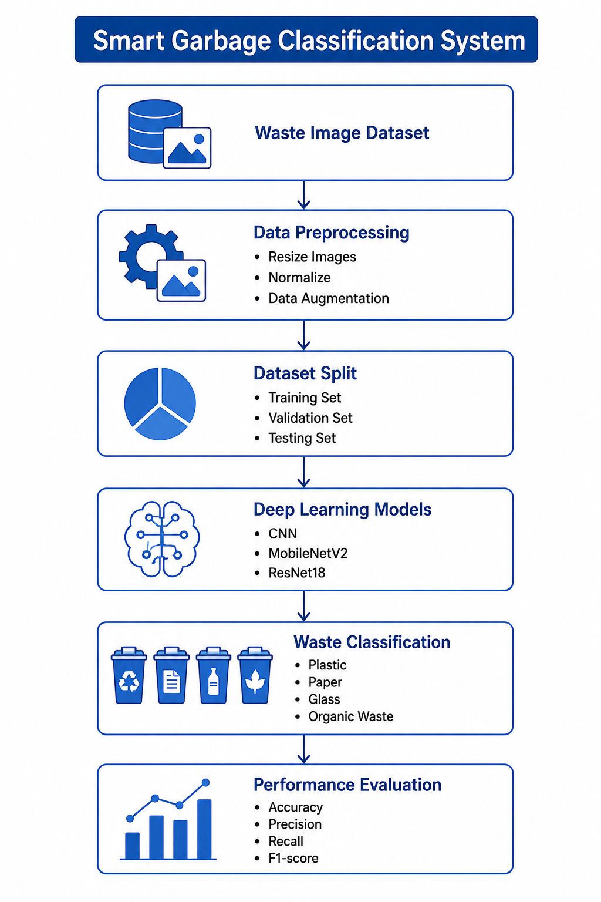

# Smart Garbage Classification System for Sri Lanka

## Project Overview

This project aims to develop an intelligent waste classification system for Sri Lanka using Deep Learning and Transfer Learning techniques. The system automatically classifies waste images into four categories:

- Plastic
- Paper
- Glass
- Organic Waste

The project is designed to improve waste segregation and support smart waste management practices in Sri Lanka.

---

## Research Objective

To develop an accurate image classification model capable of automatically identifying urban waste categories using Convolutional Neural Networks (CNNs).

---

## Project Structure

```
Smart-Garbage-Classification-System/

├── data/
│   ├── raw/
│   └── processed/
│
├── preprocessing/
│
├── models/
│
├── evaluation/
│
├── diagrams/
│
├── docs/
│
├── references/
│
├── README.md
├── requirements.txt
└── LICENSE
```
## System Architecture

The following diagram illustrates the overall architecture of the Smart Garbage Classification System.


---

## Dataset

The dataset consists of waste images collected from urban areas in Colombo, Sri Lanka.

Target classes:

- Plastic
- Paper
- Glass
- Organic Waste

---

## Data Preprocessing

The preprocessing stage includes:

- Image resizing
- Image normalization
- Data augmentation
- Removing duplicate and blurred images

---

## Proposed Model

The proposed system uses:

- MobileNetV2
- ResNet18
- Transfer Learning

---

## Baseline Model

The baseline approach uses:

- HOG Features
- Support Vector Machine (SVM)

---

## Evaluation Metrics

The model performance will be evaluated using:

- Accuracy
- Precision
- Recall
- F1-Score
- Confusion Matrix
- 5-Fold Cross Validation

---

## Technologies

- Python
- TensorFlow
- Keras
- OpenCV
- NumPy
- Pandas
- Scikit-learn
- Matplotlib

---

## Current Project Status

Repository Created

Initial Folder Structure

Data Preprocessing Scripts

Dataset Collection

Model Training

Model Evaluation

---

## Authors

- Mandulee Laknara Jayathunga
- Dilki Ishari
